# All-In-One Snapchat Downloader

A user-friendly desktop application (Windows, macOS, and Linux) to download and preserve your Snapchat memories and chat media with their original metadata, including dates and location information.

> **🎨 This is a complete UI rewrite of the original [Snapchat Memories Downloader GUI](https://github.com/ethanwheatthin/Snapchat_Memories_Downloader_GUI).**
> The single-screen interface has been replaced with a guided step-by-step wizard: pick your task (download memories, process local files, or process chat media), point the app at your directory of zip files, choose your options, and go. All the battle-tested download and metadata-processing logic from the original project is carried over unchanged.

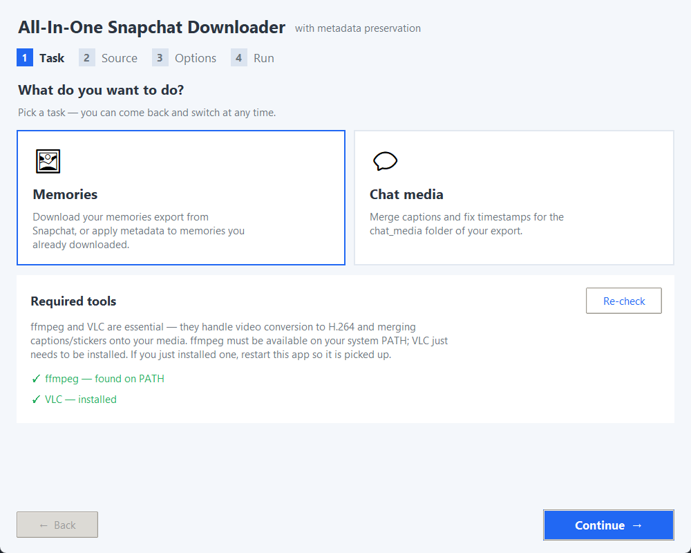

## ✨ What's new in this rewrite

- **Guided 4-step wizard** — Task → Source → Options → Run, with a step indicator and Back/Continue navigation, instead of one dense screen
- **Point it at the ZIPs** — select the folder of `mydata~*.zip` files exactly as Snapchat gives them to you; the app unzips them all automatically (resumable), finds `memories_history.json` inside, and processes everything
- **Task-first flow** — choose what you want to do up front (download memories, process already-downloaded local files, or process chat media) and the app only shows you the inputs that task needs
- **Smarter source validation** — the app inspects your `memories_history.json` when you select it and tells you how many memories it found, what year range they cover, and whether download URLs are present (so you know immediately if you need Local Files mode)
- **Inline help** — contextual links to the relevant guide sections right where you need them

## 🚀 Quick Start

**Download the official release executable** — The easiest way to use this tool:

**YouTube Video Tutorial** - https://www.youtube.com/watch?v=O32IF1Qxg2E

1. **Get the `.exe`** from the [latest release](https://github.com/ethanwheatthin/All-In-One-Snapchat-Downloader/releases)
2. **Request your Snapchat data** (see instructions below or YT video)
3. **Run the app** and follow the wizard
4. **Get FFmpeg and VLC from inside the app** — if either is missing, the first step of the wizard shows a **Download for me** button and a one-line install command you can copy. No manual hunting for installers and no computer restart needed (see [FFmpeg and VLC](#-ffmpeg-and-vlc))

## 📋 Overview

This tool downloads all your Snapchat memories using the `memories_history.json` file from your Snapchat data export. It preserves metadata like creation dates, timestamps, and GPS coordinates by embedding them directly into your downloaded media files. It also automatically merges overlay captions and stickers back onto your photos and videos when present.

## ✨ Features

- **Guided wizard UI** — No command line needed; a step-by-step flow walks you through every task
- **Bulk Download** — Download all your memories at once with retry logic
- **Resume Downloads** — Skip already downloaded files to resume interrupted sessions
- **Overlay Merging** — Automatically merges caption/sticker overlays back onto photos and videos
- **Metadata Preservation** — Embeds original dates and GPS coordinates into EXIF data (images) and file metadata (videos)
- **Video Conversion** — Automatic H.264 conversion that plays on Windows and uploads to iCloud Photos, applied to downloads, local-file imports, and chat media alike
- **One-click tool setup** — FFmpeg and VLC can be downloaded and installed from inside the app
- **Organized output** — Memories are sorted into Year / Month / Day folders
- **File Timestamps** — Sets file modification dates to match memory creation dates
- **Progress Tracking** — Real-time progress updates and detailed logging
- **Stop/Resume** — Pause and resume downloads at any time
- **Process Export ZIPs Directly** — Point the app at the folder of `mydata~*.zip` files from Snapchat; they're unzipped and processed automatically
- **Process Local Files** — Apply metadata to already-downloaded memories when Snapchat export does not include download URLs
- **Process Chat Media** — Merge captions and fix dates/timestamps for the `chat_media/` folder in your export, with senders and exact times matched from your chat history

## 🚀 Getting Started

### Using the Executable (Recommended)

1. **Download** the latest `.exe` from the [releases page](https://github.com/ethanwheatthin/All-In-One-Snapchat-Downloader/releases)
2. **Run the application** — Double-click the `.exe` file ('Run anyway' if you get a windows security warning)
3. **Set up FFmpeg and VLC** — the **Task** step checks for both. For anything missing, click **Download for me** or copy the install command shown and run it yourself, then click **Re-check** (details in [FFmpeg and VLC](#-ffmpeg-and-vlc))
4. Follow the usage instructions below
   >  **Note:** If you keep getting the "no download URL found, skipping" message, your export has no download URLs. Use **Process your export files** instead (the default). See the [Local Processing Guide](#-processing-local-files-no-download-urls).

## 📥 How to Get Your Snapchat Data

> **Note:** The memories_history.json file contains links that expire after 7 days. It is advised to move quickly when you get access to your full export from snapchat. If you get errors it's best to just request a new batch and reprocess that. If not proceed with the local processing route

1. Open **Snapchat** on your mobile device
2. Tap your **profile icon** (top-left) → **⚙️ Settings** (top-right)
3. Scroll to **Privacy Controls** → Tap **My Data**
4. **Select data to export** — Check the boxes for memories you want:

   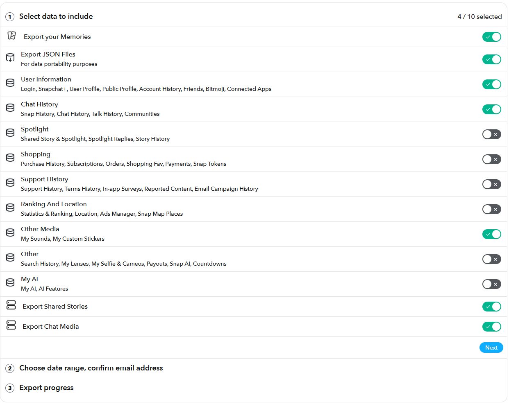

5. **Choose date range** for your memories:

   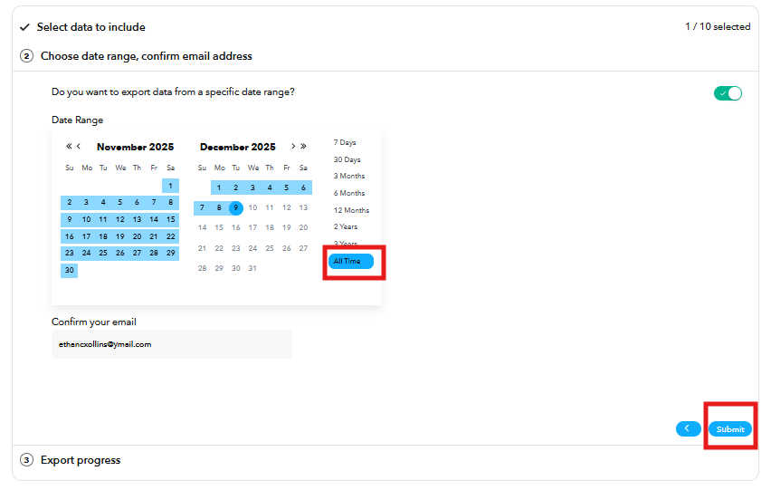

6. Tap **Submit Request**:

   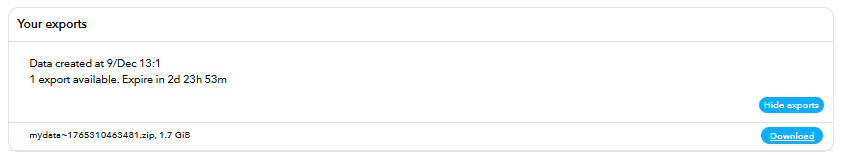

7. **Wait 24-48 hours** for Snapchat to prepare your data
8. **Download every ZIP** when you receive the email from Snapchat, and save them all into one folder — large exports are split across several `mydata~*.zip` files

   
   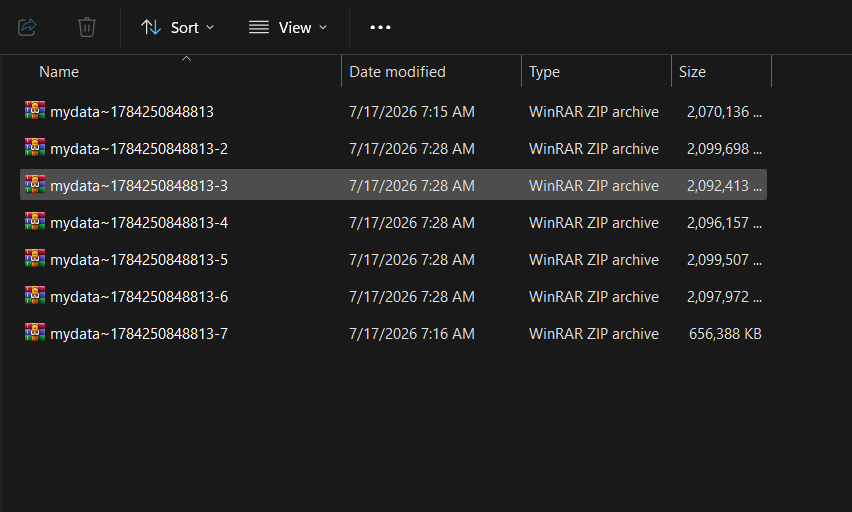
>
9. **That's it — no unzipping needed.** Point the app at the folder of ZIPs and it extracts and processes everything automatically.

## 📖 How to Use

The app walks you through four steps:

1. **Task** — Pick what you want to do: **Memories** or **Chat media**. The app also checks that ffmpeg and VLC are installed, and for anything missing offers a **Download for me** button plus a copyable install command (see [FFmpeg and VLC](#-ffmpeg-and-vlc)):

   

2. **Source** — Point the app at your export:
   - For memories (default): select the folder of `mydata~*.zip` files straight from Snapchat — no manual unzipping needed, and `memories_history.json` is found inside the ZIPs automatically. Already-extracted folders work too
   - Downloading via the URLs in `memories_history.json` is still available as a secondary method for exports that include download URLs
   - For chat media: select your `chat_media/` folder, or the folder of export ZIPs

   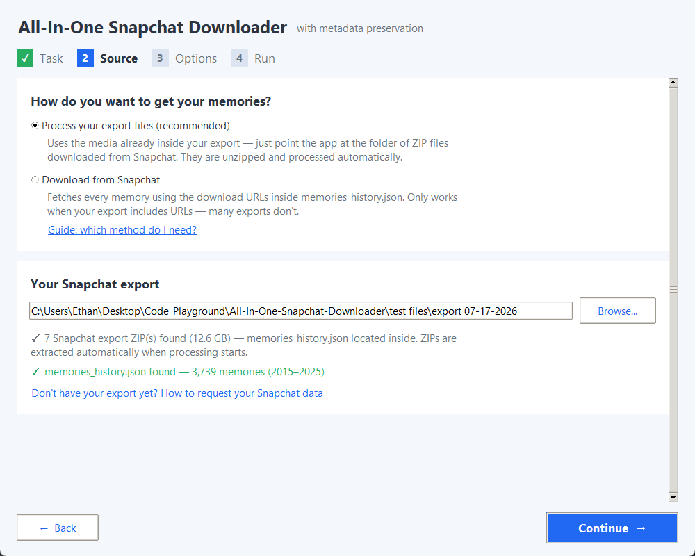

3. **Options** — Choose your output directory and configure:

   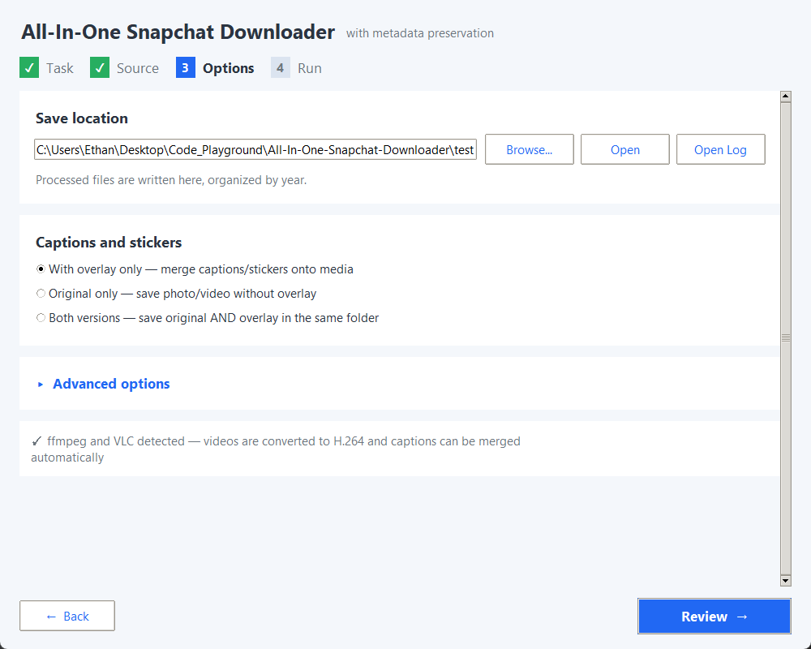

   **Resume Options:**
   - **Skip existing files (resume mode)** — Enable this to avoid re-downloading files that already exist
     - Useful when resuming after an interruption or adding new memories
     - Validates existing files and only downloads what's missing
     - Also checks for multiple filename patterns (merged overlays, collision-resolved files)
   **Timezone Handling:**
   - **Use GPS coordinates to determine local timezone** — Recommended, enabled by default
     - Automatically detects local timezone from photo/video GPS location
     - Files are named and timestamped with local time for easier organization
     - Falls back to system timezone when GPS data is unavailable or checkbox is disabled

4. **Run** — Review the plan and start. The "Open save folder" button opens your output directory at any time; "Stop" pauses (extraction and processing both resume where they left off).

   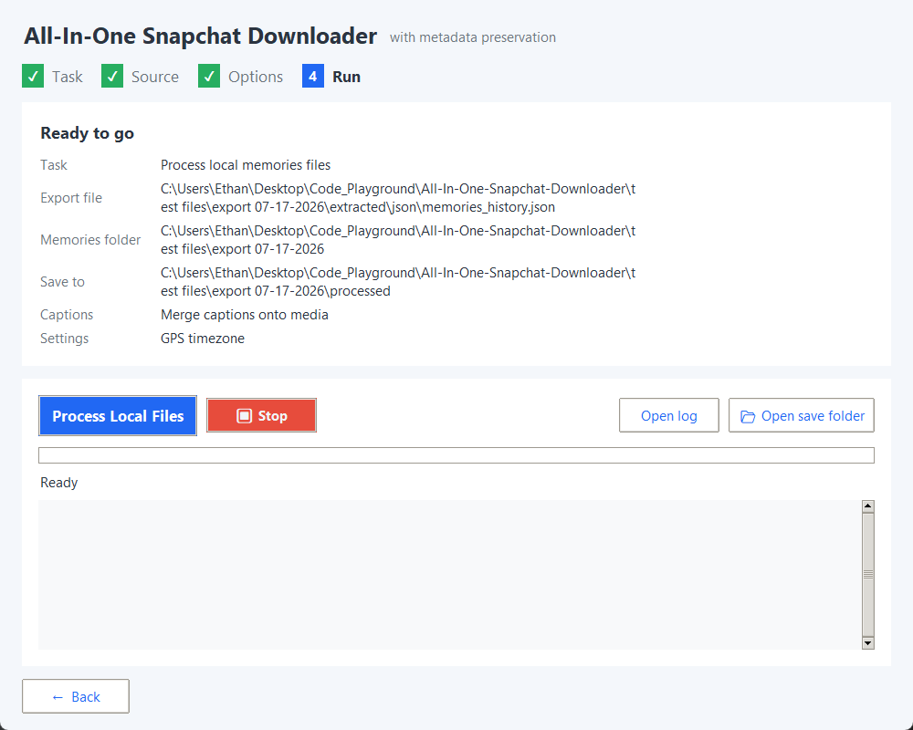

   If you selected a folder of ZIPs, they are extracted first (already-extracted files are skipped):

   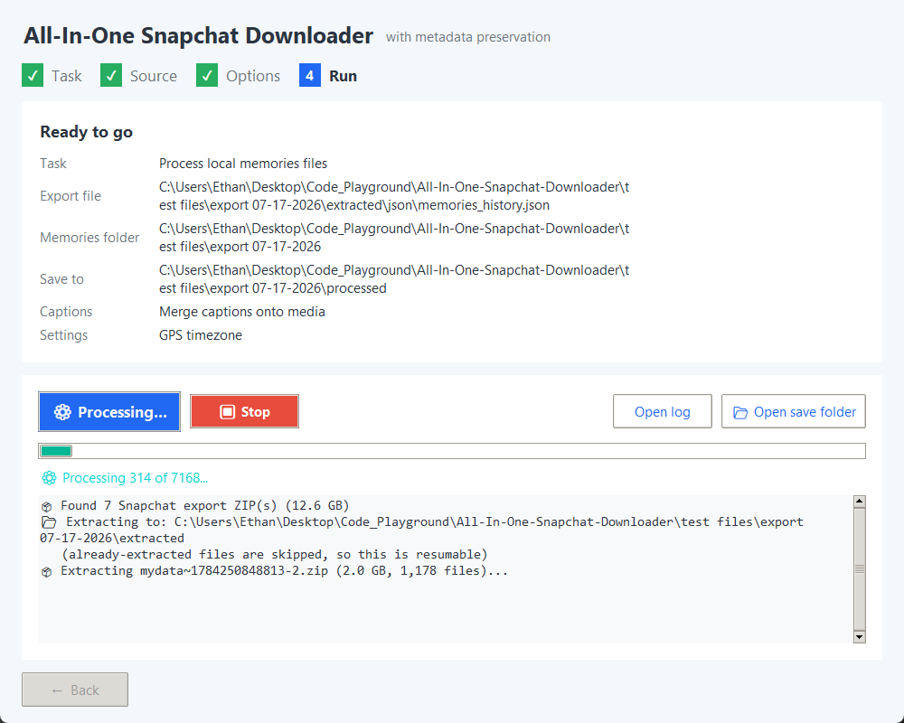

   Then every memory is processed — matched to its JSON entry, captions merged, metadata and timestamps written:

   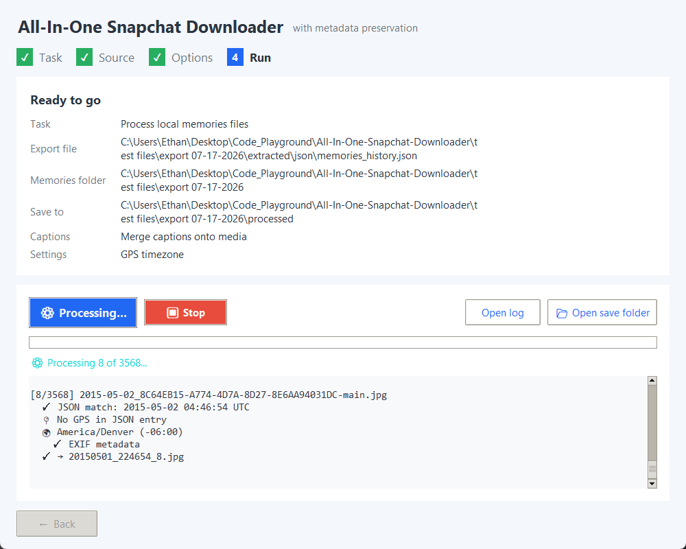

Memories are sorted into **Year / Month / Day** folders in your output directory and named by creation date, e.g. `2024/01 - January/2024-01-15/20240115_143022.jpg`. Overlays are automatically merged when detected. Files saved into a flat folder by older versions are still recognized when you resume.

Resuming is fast: extracted ZIPs and timezone lookups are cached, so a second run skips work it's already done.

## 📂 Processing Local Files (No Download URLs)

The **Source** step offers two ways to get your memories:

| Method | How it works | When to use it |
|---|---|---|
| **Process your export files (recommended)** | Uses the photos and videos already inside your export's `memories/` folders | Almost always. It works whether or not your export has download URLs |
| **Download from Snapchat** | Fetches each memory using the URLs in `memories_history.json` | Only if your export includes URLs and you didn't include the media itself |

Many Snapchat exports have an empty `Media Download Url` field for every memory. This has been confirmed across multiple accounts, so it's not a one-off. Download mode has nothing to fetch in that case and skips every file (the "no download URL found, skipping" message). The media is still inside your export ZIPs, though, so processing the export files gets you the same result: correct dates, GPS coordinates, and merged captions.

You don't need to check which kind of export you have. When you select your export, the app reads `memories_history.json` and tells you how many memories it found. If there are no download URLs, it switches to **Process your export files** automatically.

### How to use (easiest: point at the ZIPs)

1. **Download every Snapchat export ZIP** into one folder. Don't extract anything:

   ```
   export/
   ├── mydata~1784250848813.zip
   ├── mydata~1784250848813-2.zip
   ├── mydata~1784250848813-3.zip
   └── ...
   ```

2. On the **Task** step, choose **Memories**
3. On the **Source** step, keep **Process your export files (recommended)** selected. Under **Your Snapchat export**, select the folder of ZIPs. The app finds `memories_history.json` inside them and confirms something like "✓ memories_history.json found — 1,234 memories (2016–2024)"
4. On the **Options** step, choose where to save the processed files
5. Continue to the **Run** step and start processing. The ZIPs are extracted into an `extracted/` subfolder first, then every memory is processed. Both stages can be resumed: if you stop, the next run skips ZIPs that were already extracted and picks up where it left off

### How to use (already-extracted folders)

If you've already unzipped your export, that works too. Put all the extracted folders under one parent:

```
snapchat/
├── mydata~AAA123/
│   └── memories/
├── mydata~BBB456/
│   └── memories/
└── mydata~CCC789/
    └── memories/
```

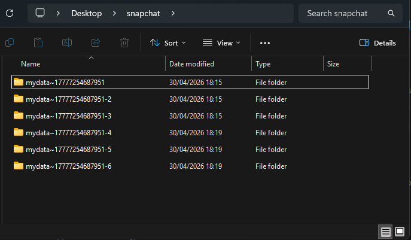

Each extracted folder has a `memories/` subfolder containing your media:

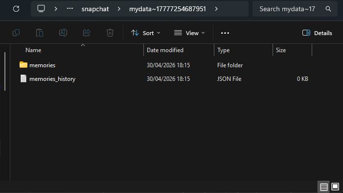

On the **Source** step, select any of these:
- The `memories/` folder from a single export (e.g. `mydata~XXX/memories/`)
- The export folder that contains it (e.g. `mydata~XXX/`)
- A parent folder holding several exports (e.g. `snapchat/`). The app finds every `mydata~*/memories/` subfolder and processes them all in one run

`memories_history.json` is found automatically in the usual export layouts. If the app can't find it, a **Memories export file** picker appears so you can select it yourself.

### How files are matched

Each file in `memories/` is matched to its entry in `memories_history.json` so the right date, time, and location get applied. The app tries these in order:

1. **Memory ID**: the ID in the filename is looked up in the JSON
2. **Timestamp**: the file's modification time (which Snapchat sets to the capture time) is compared with the JSON dates
3. **Same-day pairing**: if a day has the same number of files as JSON entries, they're paired in order. If the day has only one JSON entry, that entry is used

Files that can't be matched are still processed, using the date in their filename. They get no GPS location.

Output is identical to download mode: captions merged, EXIF/video metadata and file timestamps written, videos converted to iCloud-compatible H.264, and everything sorted into Year / Month / Day folders. To add to an existing output folder without redoing work, turn on **Skip already-processed files in the output folder** under **Advanced options** on the Options step.

## 💬 Processing Chat Media (Merge Captions + Fix Metadata)

Snapchat exports can also include a `chat_media/` folder — every photo and video saved in your chats (direct sends, saved snaps, and camera-roll shares). These files come with scrambled names, no usable timestamps, and captions stored as **separate transparent overlay images**. This mode reassembles them: captions are merged back onto their photos/videos, and correct dates, times, and file timestamps are written to every file.

### Requesting the right export from Snapchat

When you request your data at [accounts.snapchat.com](https://accounts.snapchat.com) → **My Data**, enable these toggles under "Select data to include":

- **Export JSON Files** — required for exact timestamps and sender matching
- **Chat History** — contains the message records your media files are matched against
- **Export Chat Media** — the actual photos/videos from your chats
- **Export Shared Stories** — recommended, catches media shared via stories

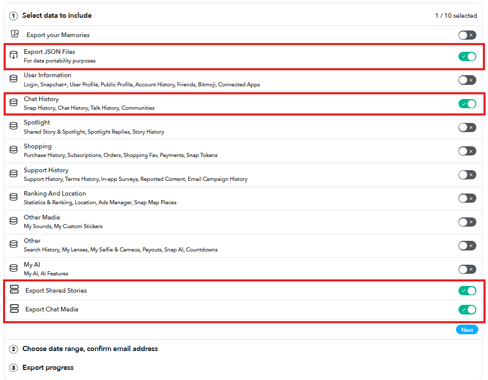

Then choose your date range and download the export ZIPs as usual — no extraction needed if you point the app at the ZIP folder. Inside, each export contains `chat_media/` and `json/` side by side:

```
mydata~XXX/
├── chat_media/       ← the media files
├── json/
│   ├── chat_history.json    ← used for exact timestamps + senders
│   └── snap_history.json
└── html/
```

### How to use

1. On the **Task** step, choose **Chat media**
2. On the **Source** step, under **Your Snapchat export**, select the folder of `mydata~*.zip` files straight from Snapchat — the ZIPs are unzipped automatically before processing. An already-extracted `chat_media/` folder (or the export folder containing it) works too. The app confirms how many files it found and whether it detected your chat history JSON
3. On the **Options** step, choose where to save the processed files and pick an **overlay mode**: merged captions only, originals only, or both
4. Continue to the **Run** step and start processing

### What the app does

- **Exact timestamps** — files are matched to your `chat_history.json` / `snap_history.json` records (typically 98%+ match rate), falling back to the video's embedded creation time, then the send time Snapchat stores in the export's file modification times, then the filename date at noon local time
- **Sender info** — the log shows who sent each file and in which conversation
- **Caption merging** — `media~` and `overlay~` files from the same snap are paired and merged. When several snaps share a date, the app verifies pairings against the export's thumbnails; captions that can't be confidently paired are never merged onto the wrong photo — they're preserved in an `unmatched_overlays/` folder instead
- **Metadata fixing** — EXIF dates (images), embedded creation dates (videos), and file created/modified timestamps are all set to the real capture time, so files sort correctly in your photo library
- **One folder per conversation** — output is sorted into a subfolder named after the message thread or group chat each file came from (on by default; turn it off under **Advanced options** on the Options step to save everything into one flat folder)
- Output files are named by capture time: `YYYYMMDD_HHMMSS_<n>.jpg` / `.mp4`

> **Notes:**
> - Chat media contains **no GPS data** (unlike memories), so timestamps use your system timezone and no location is embedded.
> - Conversation folders are named from your chat history: the group's title for group chats, the other person's username for one-to-one threads. Files the app couldn't match to any conversation go to an `Unsorted/` folder, and grouping is skipped entirely if the export has no `json/` history to identify threads with.
> - Thumbnails and metadata sidecar files from the export are consumed during processing but not copied to the output — they contain no unique media.
> - A few files in some exports are stored in an unreadable (likely encrypted) format; these are listed in the log and skipped.
> - If the `json/` folder is missing, the mode still works — it just falls back to embedded video timestamps and filename dates.

## 🎬 FFmpeg and VLC

FFmpeg and VLC handle video conversion to H.264 and merging captions/stickers onto your media. The **Task** step of the wizard checks for both. For each missing tool it shows:

- **Download for me** — the app installs it for you:
  - **FFmpeg** — downloads the official portable static build (~40 MB) into the app's own data folder and uses it right away. No administrator rights, no installer, and nothing else on your system is changed. The download is checksum-verified when the host publishes one.
  - **VLC** — installs through your system package manager (winget on Windows, Homebrew on macOS) and shows the install log live. You may be asked to approve the install. If no package manager is available, the official VLC download page opens instead.
- **A copyable install command** — if you'd rather do it yourself, click **Copy** and run it:

  | Platform | FFmpeg | VLC |
  |---|---|---|
  | Windows (PowerShell) | `winget install --exact --id Gyan.FFmpeg` | `winget install --exact --id VideoLAN.VLC` |
  | macOS (Terminal) | `brew install ffmpeg` | `brew install --cask vlc` |
  | Linux | `sudo apt install -y ffmpeg` (or `dnf` / `pacman`) | `sudo apt install -y vlc` (or `dnf` / `pacman`) |

After installing, click **Re-check** on the Task step. You no longer need to restart your computer. A command-line install may need an app restart before it's detected, but **Download for me** works straight away.

> **Note:** Without FFmpeg or VLC, the app still converts videos to iCloud-compatible H.264 and writes GPS/date metadata using its bundled PyAV library, so installing them is strongly recommended but no longer a hard requirement.

## 🔧 Technical Details

### Supported Media Types

- **Images** — JPEG/JPG with EXIF metadata
- **Videos** — MP4 with embedded metadata

### Metadata Features

- **Timezone-aware timestamps** — Uses GPS coordinates to determine correct local time (falls back to system timezone)
- **Creation date/time preservation** — Embedded in EXIF (images) and file metadata (videos)
- **GPS coordinates** — Embedded when available in original memory
- **Timezone offset tags** — EXIF 2.31 standard offset fields for proper timezone display
- **File modification timestamps** — Match local creation time for correct sorting in file managers
- **Automatic overlay/caption merging** — Combines `-main` and `-overlay` file pairs seamlessly

### Dependencies

Core libraries:
- `requests` — Network downloads
- `Pillow` — Image processing
- `piexif` — EXIF metadata (optional but recommended)
- `mutagen` — Video metadata (optional but recommended)
- `av` (PyAV) — Video processing (optional)
- `python-vlc` — VLC integration (optional)
- `timezonefinder` — GPS-based timezone detection (optional but recommended)
- `pytz` — Timezone handling (optional but recommended)

> **Note:** The application gracefully handles missing optional packages. If timezone libraries aren't installed, timestamps default to UTC. If EXIF/video metadata libraries are missing, files are still downloaded but without embedded metadata.

### External Tools

- **FFmpeg** and **VLC**: the app can install these for you. See [FFmpeg and VLC](#-ffmpeg-and-vlc)

## 🍎🐧 Running on macOS and Linux (ALPHA NEEDS TESTERS)

The app runs on macOS and Linux as well as Windows. Grab the platform build from the [releases page](https://github.com/ethanwheatthin/All-In-One-Snapchat-Downloader/releases) if one is published, or run from source (see below).

**macOS notes:**
- Grab the build that matches your Mac's chip: `AllInOneSnapchatDownloader-macos-arm64.zip` for Apple Silicon (M1/M2/M3/M4) or `AllInOneSnapchatDownloader-macos-intel.zip` for Intel Macs. Each build only runs on its own architecture — the wrong one gives "This application is not supported on this Mac." Check your chip under **Apple menu → About This Mac**.
- If you use the pre-built `.app`, macOS Gatekeeper will warn about an unsigned app the first time. Right-click the app → **Open** → **Open** to run it.
- If running from source, use Python from [python.org](https://www.python.org/downloads/) or Homebrew (`brew install python-tk`) — the Tk that ships with the old system Python is buggy.
- Use **Download for me** on the Task step to get FFmpeg (portable, no Homebrew needed) and VLC (via Homebrew), or run `brew install ffmpeg` / `brew install --cask vlc` yourself.
- The `._*` AppleDouble files and `__MACOSX/` folders macOS adds to ZIPs and external drives are ignored automatically.
- If the app's tool check says FFmpeg isn't found even though `brew install ffmpeg` worked and it runs fine in Terminal: apps launched by double-clicking (not from a shell) don't inherit your shell's PATH, so Homebrew's install dir (`/opt/homebrew/bin` on Apple Silicon, `/usr/local/bin` on Intel) can be invisible to it. The app already checks those locations directly, but if FFmpeg is installed somewhere else, make sure it's on the `PATH` your login shell sets up, then relaunch the app.

**Linux notes:**
- Tkinter is not bundled with most distro Pythons. Install it first:
  - Debian/Ubuntu: `sudo apt install python3-tk`
  - Fedora: `sudo dnf install python3-tkinter`
  - Arch: `sudo pacman -S tk`
- **Download for me** can fetch a portable FFmpeg build (x86-64 only). Install VLC from your package manager (e.g. `sudo apt install vlc`). The wizard shows the command to copy. You can also install FFmpeg the same way (`sudo apt install ffmpeg`).

## ⚙️ Building from Source

To compile the executable yourself:

```bash
# Install PyInstaller
pip install pyinstaller

# Windows
build_exe.bat

# macOS / Linux
sh build_mac_linux.sh
```
The output is created in the `dist` folder: `AllInOneSnapchatDownloader.exe` on Windows, `AllInOneSnapchatDownloader.app` on macOS, and a `AllInOneSnapchatDownloader` binary on Linux. The build is driven by `AllInOneSnapchatDownloader.spec`, which includes the necessary hidden imports for all dependencies. PyInstaller does not cross-compile — build on the OS you are targeting. The GitHub Actions workflow in `.github/workflows/build.yml` builds all three automatically on version tags.

### Running from Source

For developers or advanced users:

```bash
# Clone the repository
git clone https://github.com/ethanwheatthin/All-In-One-Snapchat-Downloader.git
cd All-In-One-Snapchat-Downloader

# Install dependencies
pip install -r requirements.txt

# Run the application
python download_snapchat_memories_gui.py
```

## 🧪 Testing

The project includes comprehensive unit tests to ensure reliability:

```bash
# Install pytest
pip install pytest

# Run all tests
python -m pytest tests/ -v

# Run specific test file
python -m pytest tests/test_filename_sanitization.py -v

# Run with detailed output
python -m pytest tests/ -v --tb=short
```

**Test Coverage:**
- **Filename sanitation** — Ensures no trailing braces or invalid characters in filenames
- **Atomic conversion** — Verifies temp file → validate → atomic replace workflow
- **Video validation** — Tests ffprobe-based validation (when available)
- **Return contracts** — Confirms consistent return types across modules
- **Tool installer** — Covers the FFmpeg/VLC "Download for me" flow (archive extraction, checksum verification, PATH handling)

## 📝 Important Notes

- **Storage Space** — Ensure sufficient disk space for all memories
- **URL Expiration** — Download links expire over time; process your data export promptly
- **Privacy** — All processing happens locally on your computer; no data is sent elsewhere
- **Cross-Platform** — Runs on Windows, macOS, and Linux (see the macOS/Linux section above for setup notes)

## 💡 Tips

- **Use Resume Mode** — Enable "Skip existing files" when resuming interrupted downloads
- **Re-convert as needed** — Use the re-conversion option if you have old HEVC videos that won't play properly
- **Download regularly** to avoid URL expiration
- **Verify metadata** by checking a few files after initial download
- **Keep your JSON** — Save a backup copy of `memories_history.json`

## 🤝 Contributing

Contributions welcome! Feel free to:
- Report bugs via [GitHub Issues](https://github.com/ethanwheatthin/All-In-One-Snapchat-Downloader/issues)
- Suggest features
- Submit pull requests

## ⚖️ License

This project is provided as-is for personal use. Use responsibly and in accordance with Snapchat's Terms of Service.

## ⚠️ Disclaimer

This tool is not affiliated with, endorsed by, or connected to Snap Inc. or Snapchat. It is an independent utility designed to help users download their own personal data from Snapchat's official data export feature.
